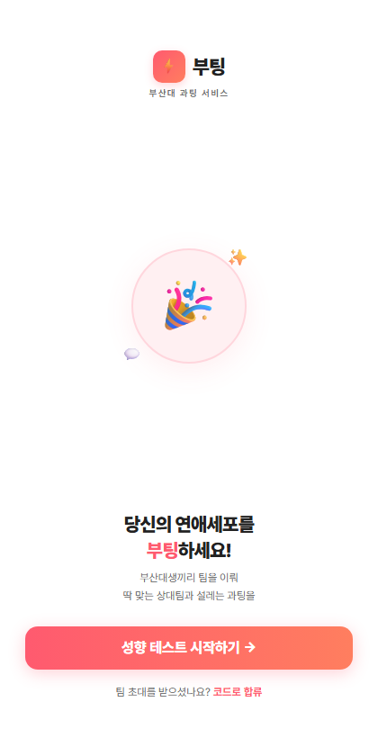
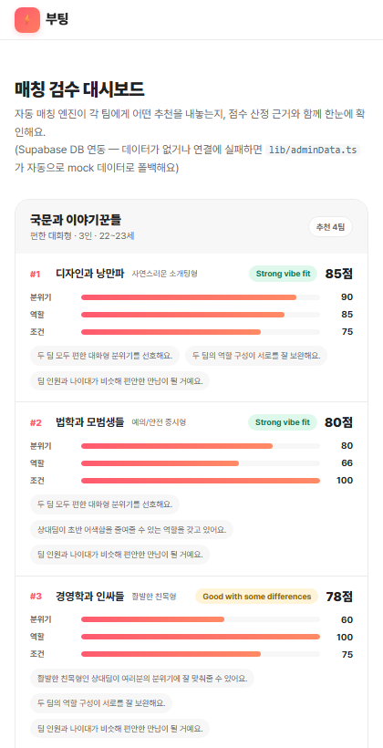
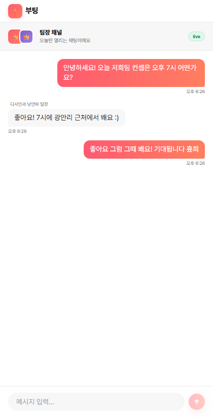

# 부팅 (Booting) — 부산대 과팅 앱

부산대학교 학생들이 친구들과 팀을 꾸려 다른 팀과 매칭되는 **그룹 과팅(단체 소개팅) 서비스**입니다.
성향 테스트 → 팀 구성 → 자동 매칭 → 팀장 채팅 → 만남 확정으로 이어지는 플로우를 제공합니다.

> Next.js 14 (App Router) + Supabase(Postgres / Auth / Realtime) 기반으로 제작되었습니다.

---

## 스크린샷

| 홈 | 매칭 검수 대시보드 (관리자) | 팀장 채팅 (Realtime) |
| --- | --- | --- |
|  |  |  |
| 성향 테스트로 진입하는 랜딩 페이지 | 자동 매칭 엔진의 추천 결과와 점수 산정 근거를 확인하는 화면. Supabase에 저장된 팀 데이터를 실시간으로 불러옵니다 (연결 실패 시 mock 데이터로 자동 폴백). | 매칭이 확정된 두 팀의 팀장이 대화하는 채널. Supabase Realtime으로 메시지가 즉시 동기화됩니다. |

---

## 주요 기능

- **성향 테스트 & 팀 생성** — 사용자가 답변한 성향을 바탕으로 팀 프로필(분위기·역할·조건)을 구성
- **자동 매칭 엔진** — 팀 간 궁합 점수(분위기/역할/조건)를 계산해 추천 순위를 산출 (`lib/matching.ts`)
- **매칭 검수 대시보드 (`/admin`)** — 각 팀에게 어떤 추천이 내려갔는지, 점수 산정 근거와 함께 한눈에 확인
- **팀장 채팅 (`/match/chat`)** — 매칭이 확정된 두 팀의 팀장이 실시간으로 대화하는 채널
  - Supabase Postgres에 메시지 영구 저장
  - Supabase Realtime(`postgres_changes`)으로 새 메시지 즉시 동기화
- **Q&A 데일리 리빌, 만남 확정 카운트다운** 등 매칭 이후 플로우 (`app/match/*`)

---

## 기술 스택

| 영역 | 기술 |
| --- | --- |
| Frontend | Next.js 14 (App Router), React 18, TypeScript, Tailwind CSS |
| Backend / DB | Supabase (Postgres, Row Level Security, Realtime) |
| 클라이언트 SDK | `@supabase/supabase-js` v2 |
| 테스트 | Jest |
| 배포 | Vercel |

---

## 디렉토리 구조

```
app/
├── admin/           # 매칭 검수 대시보드
├── match/           # 매칭 결과 / 채팅 / Q&A / 만남 확정 플로우
├── team/            # 팀 생성·초대
└── test/            # 성향 테스트

components/          # 공용 UI 컴포넌트
data/                # mock 데이터 (Supabase 미설정 시 폴백)
lib/
├── supabase.ts      # Supabase 클라이언트 (env 미설정 시 null로 안전하게 폴백)
├── adminData.ts     # 매칭 대시보드용 데이터 어댑터 (DB ↔ mock 자동 전환)
├── matching.ts      # 팀 간 궁합 점수 산정 로직
└── storage.ts       # localStorage 기반 로컬 세션 저장

supabase/
└── migrations/      # DB 스키마 + RLS 정책 + 시드 데이터 마이그레이션
```

---

## 시작하기

### 1. 의존성 설치

```bash
npm install
```

### 2. 환경변수 설정

`.env.example`을 복사해 `.env.local`을 만들고 Supabase 프로젝트의 URL과 anon key를 입력합니다.

```bash
cp .env.example .env.local
```

```
NEXT_PUBLIC_SUPABASE_URL=https://<your-project>.supabase.co
NEXT_PUBLIC_SUPABASE_ANON_KEY=<your-anon-key>
```

> 환경변수가 없어도 앱은 정상 구동됩니다 — `lib/supabase.ts`가 클라이언트를 `null`로 두고, `lib/adminData.ts`가 자동으로 `data/mockTeams.ts`의 mock 데이터로 폴백합니다. 다만 이 경우 채팅 기능은 비활성화됩니다.

### 3. DB 마이그레이션 적용 (Supabase CLI)

SQL Editor 복붙은 줄바꿈/인코딩이 깨질 수 있어 **CLI 사용을 권장**합니다.

```bash
npx supabase link --project-ref <project-ref> -p <db-password>
npx supabase db push --include-all
```

### 4. 개발 서버 실행

```bash
npm run dev
```

[http://localhost:3000](http://localhost:3000) 에서 확인할 수 있습니다.

---

## Supabase 스키마 개요

`supabase/migrations/`에 정의되어 있으며, 핵심 테이블은 다음과 같습니다.

- **`teams`** — 팀 이름, 인원, 연령대, 분위기 등 팀 프로필
- **`team_members`** — 팀원 닉네임, 역할, 성향 점수(JSONB), 리더 여부
- **`chat_messages`** — 매칭별(`match_id`) 팀장 채팅 메시지 (Realtime publication 등록)

모든 테이블에 RLS(Row Level Security)가 적용되어 있으며, 익명(anon) 역할은 읽기 위주로 제한된 권한만 가집니다.

---

## 협업 규칙

이 저장소는 두 명이 함께 작업합니다 — 자세한 내용은 [`docs/COLLABORATION.md`](../docs/COLLABORATION.md), [`docs/INTERFACE_CONTRACT.md`](../docs/INTERFACE_CONTRACT.md)를 참고하세요.

- `lib/types.ts` 변경 시 → PR + 상대방 리뷰 필수
- `supabase/migrations/` 신규 파일 추가 시 → 상대방 확인 없이 main 머지 금지
- `main` 브랜치 직접 push 금지

---

## 배포

[Vercel](https://vercel.com)에 연결되어 있으며, `main` 브랜치 push 시 자동 배포됩니다. 배포 환경에도 `NEXT_PUBLIC_SUPABASE_URL` / `NEXT_PUBLIC_SUPABASE_ANON_KEY` 환경변수를 등록해야 실제 DB와 연동됩니다.
